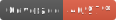

# Release Notes Generator (RNG)
[](https://github.com/Dinodanio/release-notes-generator/actions/workflows/test.yml)
[](https://github.com/Dinodanio/release-notes-generator/actions/workflows/docker-image.yml)


## DSL
The merge commit description must contain specific schema to get parsed. 

```markdown
## Changelog / ##Changelog
* $NF: Changed the speed of the Batmobil.
* $F: Changed the color of the Batmobil.
* $CB: Changed the wheels air pressure.
* $IB: Changed the wheels air pressure.
```

Everything below the `Changelog` headline gets parsed and persisted.

### Tags
* `* $F:` Functional, all stakeholders
* `* $NF:` Non-Functional, internal stakeholders
* `* $CB:` Customer Bugs, all stakeholders
* `* $IB` Internal Bugs, internal stakeholders
